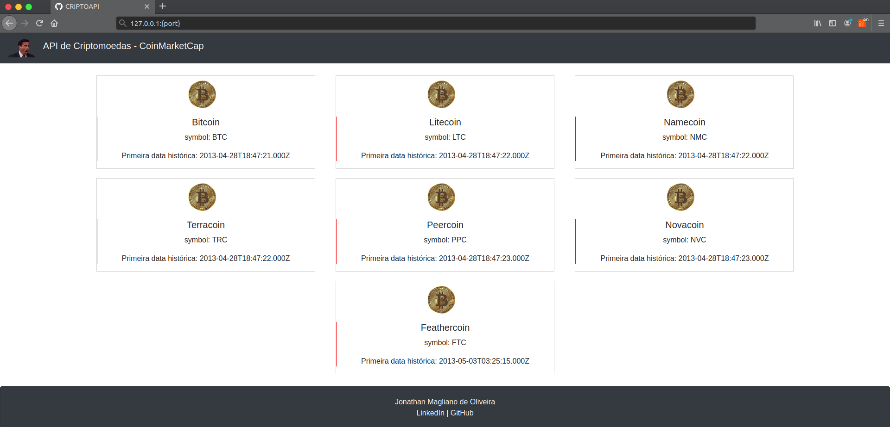

# API Criptomoedas
- O teor do projeto é dado por uma requisição de dados de uma API de criptomoedas com JavaScript. Desafio proposto pelo bootcamp da empresa Everis.
- Foi criado uma conta na coinmarketcap para obter a API Key e foi adicionado a extensão Moesif Origin & CORS Changer no navegador para exibição da resposta da API. 

## Dados da API no navegador
[Documentação API](https://coinmarketcap.com/api/documentation/v1/)

<h4>Utilizou-se o Bootstrap CDN;</h4>

<h3>JavaScript: </h4>
    <ul>
        <li>fetch</li>
        <li>then</li>
        <li>catch</li>
        <li>response</li>
    </ul>
